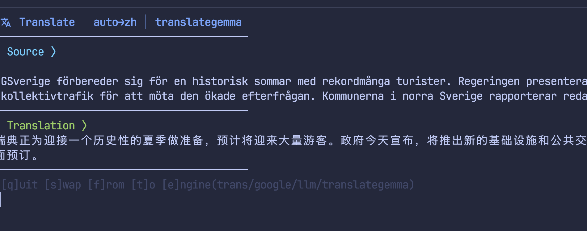

# tmux-translator

[](README.md) [](README-zh.md) [](README-sv.md)

Translate selected text in tmux with an interactive popup. Fork of [sainnhe/tmux-translator](https://github.com/sainnhe/tmux-translator).



## Features

- Interactive popup with keybindings (swap, change language, change engine)
- 4 translation engines: `trans`, `google`, `translategemma`, `llm`
- Clean output (source text separated from translation)
- Handles multi-line selections
- Short aliases for engine switching (`g`, `tg`, `l`)

## Requirements

- tmux >= 3.2
- [`trans`](https://github.com/soimort/translate-shell) — default engine
- `uv` + `requests` — for `google` engine
- `uv` + `mlx-lm` — for `translategemma` engine (Apple Silicon only)
- OpenAI-compatible LLM server — for `llm` engine

## Installation

```tmux
set -g @plugin 'monkeyxite/tmux-translator'
```

Reload and press `prefix + I` to install.

## Usage

1. Enter copy mode: `prefix + [`
2. Select text (vi mode: `v` + movement)
3. Press `t` — popup appears with translation

### Popup keybindings

| Key | Action |
|-----|--------|
| `q` / `Enter` | Quit |
| `s` | Swap from↔to languages |
| `f` | Change source language |
| `t` | Change target language |
| `e` | Change engine (trans/g/tg/l) |

## Engines

| Engine | Alias | Offline | Notes |
|--------|-------|---------|-------|
| `trans` | — | ❌ | Google Translate via [translate-shell](https://github.com/soimort/translate-shell). **Default** |
| `google` | `g` | ❌ | Google Translate via Python. Needs `uv` + `requests` |
| `translategemma` | `tg` | ✅ | [translategemma-4b](https://huggingface.co/mlx-community/translategemma-4b-it-4bit) via oMLX. Apple Silicon |
| `llm` | `l` | ✅ | Any OpenAI-compatible LLM. Configurable model/endpoint |

### Benchmark (MacBook Pro M5 24GB, sv→en)

```
                    Short (2 words)    Medium (31 words)    Long (118 words)
                    ─────────────────────────────────────────────────────────
trans            ▓▓ 0.5s              ▓▓ 0.5s              ▓▓▓ 0.8s
google           ▓▓ 0.6s              ▓ 0.3s               ▓ 0.2s
tg (oMLX)        ▓▓ 0.6s              ▓▓▓▓▓▓▓ 1.5s         ▓▓▓▓▓▓▓▓▓▓▓▓▓▓ 4.2s
llm (gemma-26b)  ▓▓▓▓▓▓▓▓▓▓▓▓▓▓▓ 15s  ▓▓▓▓▓▓▓▓ 8s          ▓▓▓▓▓▓▓▓▓▓▓▓▓▓▓▓▓▓▓▓▓ 21s
```

**Key takeaways:**
- `trans`/`google` — constant ~0.5s regardless of length (network-bound)
- `tg` (oMLX) — scales linearly with text length, ~0.6s for short, ~4s for paragraphs
- `llm` — slowest, use only when you need a specific model's style
- `tg` requires a one-time [chat template patch](#translategemma-setup) for oMLX


## Configuration

```tmux
set -g @tmux-translator "t"              # trigger key
set -g @tmux-translator-from "auto"      # source language
set -g @tmux-translator-to "en"          # target language
set -g @tmux-translator-engine "trans"   # default engine
set -g @tmux-translator-width "60%"      # popup width
set -g @tmux-translator-height "60%"     # popup height
```

### translategemma setup

The `tg` engine uses translategemma-4b via oMLX for fast offline translation. Requires a one-time chat template patch (the original uses a non-standard format that oMLX doesn't support).

1. Download the model in oMLX: `mlx-community/translategemma-4b-it-4bit`
2. Patch the chat template:
   ```bash
   MODEL_DIR=~/.local/share/omlx/translategemma-4b-it-4bit
   cp "$MODEL_DIR/chat_template.jinja" "$MODEL_DIR/chat_template.jinja.orig"
   curl -sL https://raw.githubusercontent.com/monkeyxite/tmux-translator/master/engine/chat_template_translategemma.jinja \
     > "$MODEL_DIR/chat_template.jinja"
   ```
3. Restart oMLX

The patched template accepts `"sv to en: text"` format while remaining compatible with the original structured format.

### LLM engine

The `llm` engine uses any OpenAI-compatible API:

```tmux
set -g @tmux-translator-llm-api-base "http://127.0.0.1:8000/v1"
set -g @tmux-translator-llm-model "gemma-4-26b-a4b-it-4bit"
set -g @tmux-translator-llm-api-key-cmd "pass show ai/omlx"
```

Works with Ollama, vLLM, OpenRouter, etc:

```tmux
set -g @tmux-translator-llm-api-base "http://127.0.0.1:11434/v1"
set -g @tmux-translator-llm-model "qwen3:8b"
set -g @tmux-translator-llm-api-key-cmd "echo ollama"
```

## Language codes

Standard ISO codes: `en`, `zh`, `sv`, `de`, `fr`, `ja`, `ko`, `auto` (auto-detect, not supported by `translategemma`).

## Changes from upstream

- 4 engines (trans, google, translategemma, llm) with short aliases
- Interactive popup with live engine/language switching
- `tmux save-buffer` instead of fragile `xargs` piping
- Fixed `NoneType` errors in `translator.py` for Google API changes
- `uv run` for Python dependency management
- Clean output: strips duplicate source text and alternatives
- Increased default popup size (60%)

> 📝 The [Chinese](README-zh.md) and [Swedish](README-sv.md) READMEs were translated using this plugin's `tg` engine. 🐕
